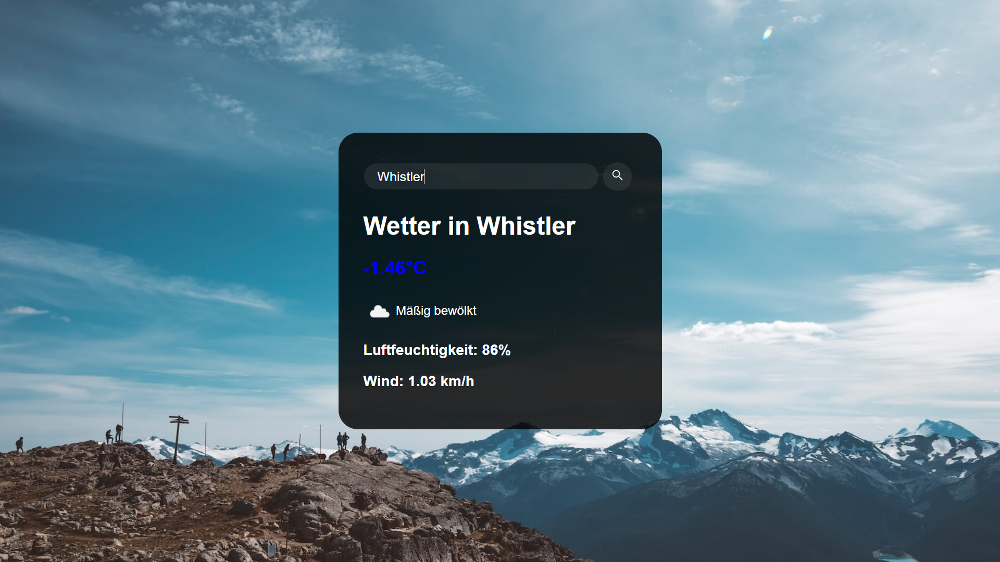
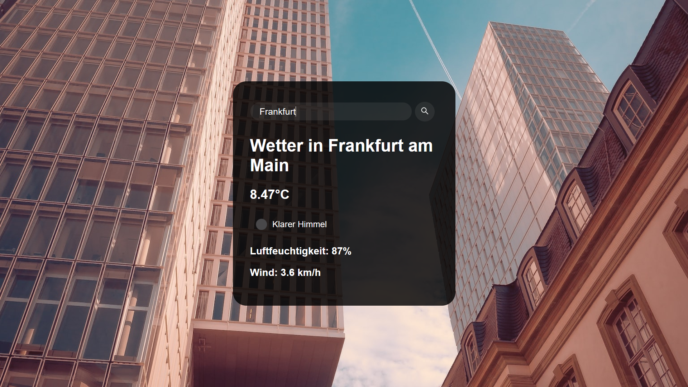

# WeatherApp
### Ein einfaches Wetter-App als Demo für mein Portfolio. Demo zeigt den Umgang mit API-Requests, Datenverarbeitung und Darstellung in einer App.
- benutzt die [OpenWeatherMap API](https://openweathermap.org/api) um die Wetterdaten zu erhalten
- benutzt unsplash für die Hintergrundbilder

## Screenshots

